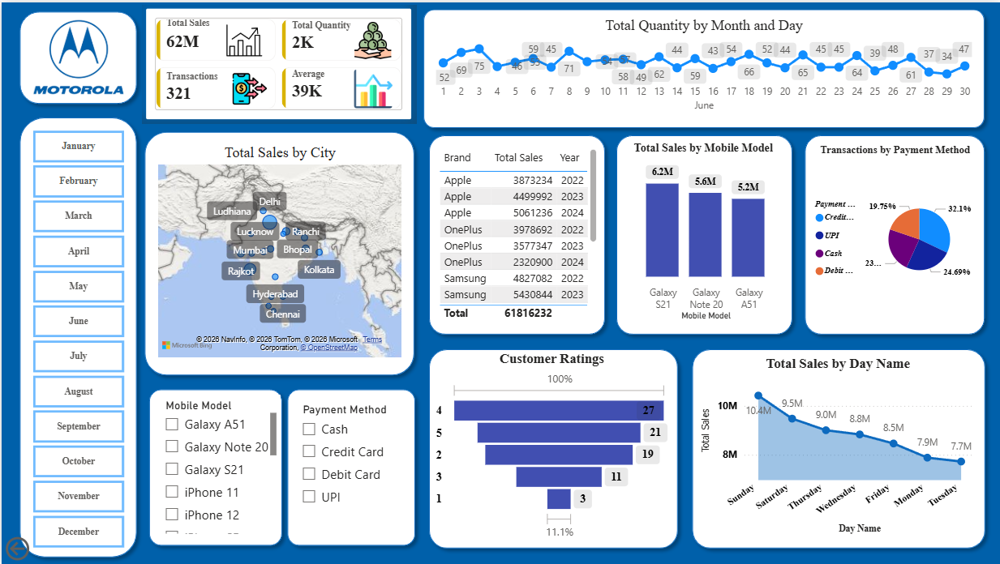

# Motorola-mobile-sales-dashboard
Interactive Power BI dashboard for analyzing Motorola mobile sales performance and business insights.

# 📱 Motorola Mobile Sales Dashboard

An interactive Power BI dashboard that analyzes Motorola mobile sales performance using key business metrics and visualizations. The dashboard provides valuable insights into sales trends, customer ratings, payment methods, city-wise performance, and product-wise analysis to support data-driven decision-making.

---

## 📊 Dashboard Preview



---

## ✨ Features

- 📈 Sales Performance Overview
- 💰 Total Sales, Total Transactions & Average Sales KPIs
- 📦 Total Quantity Sold Analysis
- 📅 Month-wise Sales Trend
- 🗺️ City-wise Sales Analysis using Map Visualization
- 📱 Mobile Model-wise Sales Comparison
- 💳 Payment Method Distribution
- ⭐ Customer Ratings Analysis
- 📆 Sales by Day of the Week
- 🎯 Interactive Filters for Month, Mobile Model, and Payment Method

---

## 🛠️ Tools & Technologies

- Microsoft Power BI Desktop
- Power Query
- DAX (Data Analysis Expressions)
- Microsoft Excel
- Bing Maps Visualization

---

## 📂 Repository Structure

```text
Motorola-Mobile-Sales-Dashboard/
│
├── Dataset/
│   └── Motorola Mobile Sales Data.xlsx
│
├── Screenshot/
│   └── dashboard_Preview.png
│
├── Mobile_sales_final Dashboard.pbix
│
└── README.md
```


## 📌 Dataset

The dataset used for this dashboard is available in the **Dataset** folder.

---

## 🚀 How to Use

1. Clone or download this repository.
2. Open **Mobile_sales_final Dashboard.pbix** in Microsoft Power BI Desktop.
3. If required, reconnect the dataset from the **Dataset** folder.
4. Explore the interactive dashboard and its visualizations.

---

## 📈 Dashboard Insights

This dashboard helps analyze:

- Overall sales performance
- Sales by city
- Mobile model performance
- Customer purchasing behavior
- Preferred payment methods
- Customer ratings
- Monthly sales trends

---

## 💡 Skills Demonstrated

- Data Cleaning
- Data Transformation
- Data Modeling
- DAX Measures
- Power Query
- KPI Development
- Interactive Dashboard Design
- Business Intelligence
- Data Visualization

---

## 📄 Note

This repository contains the Power BI report (`.pbix`) along with the dataset required to explore the dashboard locally using Microsoft Power BI Desktop.

---

## 👩‍💻 Author

**Priyanshi Nishad**

If you found this project useful, feel free to ⭐ this repository.
